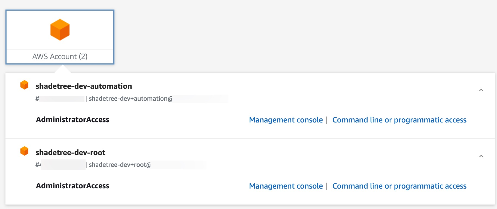

# terraform-aws-sso-permission-sets-example
This project can be used to create new [AWS IAM Identity Center (SSO)](https://docs.aws.amazon.com/singlesignon/latest/userguide/what-is.html) Permission Sets. The `Terraform` code in this repository uses [AWS Secrets Manager](https://docs.aws.amazon.com/secretsmanager/latest/userguide/managing-secrets.html) to store key-value pairs that help us map AWS Managed IAM Policies to new Permission Sets, as well as assigning them to accounts, and granting groups access through IAM Identity Center.

While this sounds relatively straightforward, there is a **lot** to be desired with AWS SSO, so I hope that this simplifies the process for you!

This project was created as a complement to blog content written for [https://shadetree.dev](https://shadetree.dev)

# Overview
Managing SSO permissions in AWS can be...tedious to say the least. Hopefully using `Terraform` will make at least the provisioning process easier so that you can add or modify them more scalably!

By providing the values we'll need in `secrets`, they can be kept up independent of `Terraform` code, and we are not storing any sensitive details like lots of users, groups, and accounts. The examples in this project use generic role-based access control (RBAC) by using five (5) persona roles:
- `SecurityAuditors` - a role that will have the `SecurityAudit` managed policy attached
- `DBAdmins` - a role that will be granted `AmazonDynamoDBFullAccess` and `AmazonRDSFullAccess`
- `FinanceBeanCounters` - a role that will be granted the job role (edge case syntax, more on that) `Billing`
- `ManagersWhoWontLogInAnyway` - a role that is granted `ReadOnlyAccess`
- `DevOpsAdmins` - a role that gets the `AdministratorAccess` managed policy

This is not intended to be wholly useful in its construction, but is a bit of a tongue-in-cheek example of some typical enterprise roles.

# Getting Started
This project assumes that you are using a `remote s3 backend` state. You will need to update the `bucket`, `dynamodb_table`, and `region` accordingly. If you use another `backend` type, or if you intend to just use `local` then you can comment out the provided configuration.

## Prerequisites
This project assumes that you are using `AWS Secrets Manager secrets` to store key configuration data. This is a generic example, constructed from the premise of [this blog post](https://shadetree.dev/2024/02/02/aws-single-sign-on-sso-make-it-suck-less-with-terraform-and-secrets-manager/). Here's the TL;DR:
1. Ensure that you have access to the AWS account where you will be deploying these resources. You should ideally use a [delegated administrator](https://docs.aws.amazon.com/singlesignon/latest/userguide/delegated-admin.html) account for a few key reasons:
    1. ***ANY*** Permission Set you create from the AWS Organizations management account **cannot** be modified later, anywhere but in management account. You would otherwise have to destroy and recreate these permission sets to manage them in a delegated account.
  **NOTE: You actually cannot assign anyone permission TO your management account from outside if it, no matter what. So if you have need for that through `Terraform`, you should add a `providers.tf` entry for that account and use it accordingly**
    2. You should keep ***any and all functions out of the management account*** that you possibly can! This is a known best practice, and delegating access to a separate account makes it easier for Role-based Access Control, maybe via SSO roles even ;)
2. IAM Identity Center should be set up already and have groups / users we will be managing.
3. Set up three (3) secrets, where the `key` will always be the name you want to give your Permission Sets. I recommend storing them in paths like:
    - `/aws/org/sso/managed-policies` for the mapping of `PermissionSetName` to `AWS Managed IAM Policies` by ***names*** (we do the ARN construction in the code)
    - `/aws/org/sso/account-mapping` for the mapping of `PermissionSetName` to a comma-separated list of account IDs
    - `/aws/org/sso/group-mapping` for the mapping of `PermissionSetName` to IAM Identity Center group ***names*** (we do the ID lookups in the code)
  
      For users you can do something similar, and should be able to follow the same logic in the `locals.tf` of the `modules/permission-set` 

You can find an example of this setup in [this blog post](https://shadetree.dev/2024/02/02/aws-single-sign-on-sso-make-it-suck-less-with-terraform-and-secrets-manager/), which is the inspiration for this code!

1. `/aws/org/sso/managed-policies` 
  

2. `/aws/org/sso/account-mapping`

In my example I am using two (2) accounts, because this is a demo environment. This code should work for any number `n` accounts by `m` groups thanks to the witchcraft of `locals.tf` hackery that goes on!

3. `/aws/org/sso/group-mapping`


## Setup
1. Make sure you have [installed the Terraform cli](https://developer.hashicorp.com/terraform/tutorials/aws-get-started/install-cli)
If you are a MacOS user, this can be accomplished via [Homebrew](https://brew.sh/):
```
brew tap hashicorp/tap
brew install hashicorp/tap/terraform
```

2. Configure your `providers` as needed, either using the SSO profile via `profile = "your-profile-name"` or by assuming a role with the `assume_role {}` block.
```
provider "aws" {
  region = var.region
  # for local use, if you can assume the role specified no changes required
  # otherwise, you can use your local SSO profile by commenting OUT assume_role
  # and commenting in your profile
  profile = "automation"
  #   assume_role {
  #     role_arn = "arn:aws:iam::${var.account_id}:role/OrganizationAccountAccessRole"
  #   }
}
```
**NOTE: The `OrganizationAccountAccessRole` is a default role created by AWS. You will need to have a trust policy allowing access to assume it if you use this, otherwise replace it with a valid role in the account**

3. Make sure that you provide the mandatory parameters for this project to deploy. If running this locally, you can `export` the values as environment variables like so:
```
export TF_VAR_account_id="your-delegated-sso-admin-account"
export TF_VAR_name="workspace-name"
export TF_VAR_region="your-aws-region"
```

In this project, `TF_VAR_name` is not really used other than setting the `workspace` but I keep these variables consistent across all my projects, so keep up the habit and you'll be able to use many of these :) 


## `terraform init, plan, apply` through `Makefile`
This project includes a `Makefile` that will run your `terraform <command>` functions accordingly, and automatically sets up a [Terraform Workspace](https://developer.hashicorp.com/terraform/language/state/workspaces). If you do use a remote backend, you can set the `workspace_key_prefix` in `backend.tf` to whatever you want the parent "folder" to be for this.

If you have exported the proper variables as described in the above [Setup](#setup) section, then you should be able to run your commands!
```
make init
# OUTPUT
make plan
# OUTPUT
make apply
```

If you prefer to run the commands yourself, you can simply follow the typical `terraform init` and `terraform plan/apply` stages, but I find the `Makefile` streamlines things and this is a common pattern for managing `Terraform`.

You should see output similar to this if you succeeded:

### init
```
make init                                                                                ✭ ✱
Formatting Terraform files...
Initializing Terraform...
terraform init -reconfigure 

Initializing the backend...

Successfully configured the backend "s3"! Terraform will automatically
use this backend unless the backend configuration changes.
Initializing modules...

Initializing provider plugins...
- Reusing previous version of hashicorp/aws from the dependency lock file
- Using previously-installed hashicorp/aws v5.35.0

Terraform has been successfully initialized!
```

### plan
```
make plan
# bunch of output about your resources
.
.
.
Plan: 19 to add, 0 to change, 0 to destroy.

────────────────────────────────────────────────────────────────────────────────────────────────────────────────────────────────────────────────

Saved the plan to: tfplan

To perform exactly these actions, run the following command to apply:
    terraform apply "tfplan"
```

### apply
```
make apply
# bunch of output with too many unique IDs I am too lazy to mask, so they are ommitted
. 
.
.
Apply complete! Resources: 19 added, 0 changed, 0 destroyed.
```

### destroy
If you want to destroy your resources, you can do so by running `make destroy`, which will prompt you for approval.
```
make destroy
.
.
.
Plan: 0 to add, 0 to change, 19 to destroy.

Do you really want to destroy all resources in workspace "sso-demo"?
  Terraform will destroy all your managed infrastructure, as shown above.
  There is no undo. Only 'yes' will be accepted to confirm.

  Enter a value: yes
.
.
.
Destroy complete! Resources: 19 destroyed.
```

# Test the code!
If you want to make sure it actually works, you can add your user to several groups. Here I have added myself to all of the groups for this project, but not yet run the code:



As you can see, I just have two (2) accounts with my lazy `AdministratorAccess` SSO role. Then, after running applying the `Terraform` code from this project:


As soon as it is done applying, if you refresh the SSO UI, you can see three (3) accounts that I now have access to, as well as a bunch of new roles assigned to the matching accounts!

You should just as quickly be able to `destroy` and refresh to see them gone again. Neat, eh? :)

# Terraform Details
This information was generated using [terraform-docs](https://github.com/terraform-docs/terraform-docs). You can install this per the instructions provided in its respective project repository, and then generate a table like below using:
```
terraform-docs markdown table . | pbcopy
```
(the `pbcopy` command is specific to MacOS and used to copy to clipboard; your command may vary)

## Requirements

| Name | Version |
|------|---------|
| <a name="requirement_terraform"></a> [terraform](#requirement\_terraform) | >= 1.5.0 |
| <a name="requirement_aws"></a> [aws](#requirement\_aws) | >= 5.20 |

## Providers

| Name | Version |
|------|---------|
| <a name="provider_aws"></a> [aws](#provider\_aws) | 5.35.0 |

## Modules

| Name | Source | Version |
|------|--------|---------|
| <a name="module_permission-set"></a> [permission-set](#module\_permission-set) | ./modules/permission-set | n/a |

## Resources

| Name | Type |
|------|------|
| [aws_secretsmanager_secret.accounts](https://registry.terraform.io/providers/hashicorp/aws/latest/docs/data-sources/secretsmanager_secret) | data source |
| [aws_secretsmanager_secret.groups](https://registry.terraform.io/providers/hashicorp/aws/latest/docs/data-sources/secretsmanager_secret) | data source |
| [aws_secretsmanager_secret.policies](https://registry.terraform.io/providers/hashicorp/aws/latest/docs/data-sources/secretsmanager_secret) | data source |
| [aws_secretsmanager_secret_version.accounts](https://registry.terraform.io/providers/hashicorp/aws/latest/docs/data-sources/secretsmanager_secret_version) | data source |
| [aws_secretsmanager_secret_version.groups](https://registry.terraform.io/providers/hashicorp/aws/latest/docs/data-sources/secretsmanager_secret_version) | data source |
| [aws_secretsmanager_secret_version.policies](https://registry.terraform.io/providers/hashicorp/aws/latest/docs/data-sources/secretsmanager_secret_version) | data source |
| [aws_ssoadmin_instances.sso](https://registry.terraform.io/providers/hashicorp/aws/latest/docs/data-sources/ssoadmin_instances) | data source |

## Inputs

| Name | Description | Type | Default | Required |
|------|-------------|------|---------|:--------:|
| <a name="input_account_id"></a> [account\_id](#input\_account\_id) | The 12 digit AWS account ID to deploy resources to | `string` | `""` | no |
| <a name="input_name"></a> [name](#input\_name) | The name you want to give to resources created | `string` | `""` | no |
| <a name="input_region"></a> [region](#input\_region) | The AWS region where resources should be deployed | `string` | `"us-west-2"` | no |
| <a name="input_sso_enabled"></a> [sso\_enabled](#input\_sso\_enabled) | Flag for whether or not to look up SSO role for bucket and key access | `bool` | `true` | no |

## Outputs

No outputs.